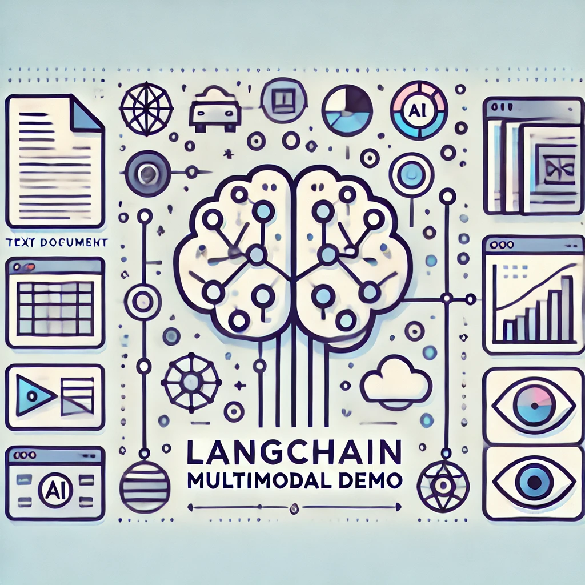

<p align="center">
  
</p>


# langchain_multimodal_demo
A LangChain-based RAG demo capable of understanding and retrieving from text, tables, and images using a multimodal pipeline.


# 🧠 LangChain Multimodal RAG Demo

This project is a simple yet powerful illustration of **Retrieval-Augmented Generation (RAG)** using **LangChain** with **multimodal inputs** — including **text, images, and tables**.

The core idea is to demonstrate how a multimodal RAG pipeline can:
- Read textual documents 📄
- Understand and extract data from tables 📊
- Analyze and describe images 🖼️

> 🔍 Powered by LangChain + Vision Models + Embedding-based Retrieval

## 📂 File

- `langcjain_multimodal.ipynb`: The main notebook showcasing the demo.

## 🛠️ Technologies Used

- LangChain
- OpenAI / DeepSeek / Hugging Face APIs
- Multimodal embedding models (e.g., CLIP or similar)
- FAISS or vector DB for retrieval

## 🧪 What It Does

- Accepts user queries in natural language
- Retrieves relevant data chunks (text/table/image)
- Uses a language model to answer based on retrieved context

## 🔧 Setup (Example)

```bash
pip install langchain openai faiss-cpu pillow matplotlib pandas
pip install langchain langchain-openai langchain_openai langchain-community langchain-groq
pip install chromadb tiktoken pillow lxml unstructured[all-docs] python_dotenv ipykernel

